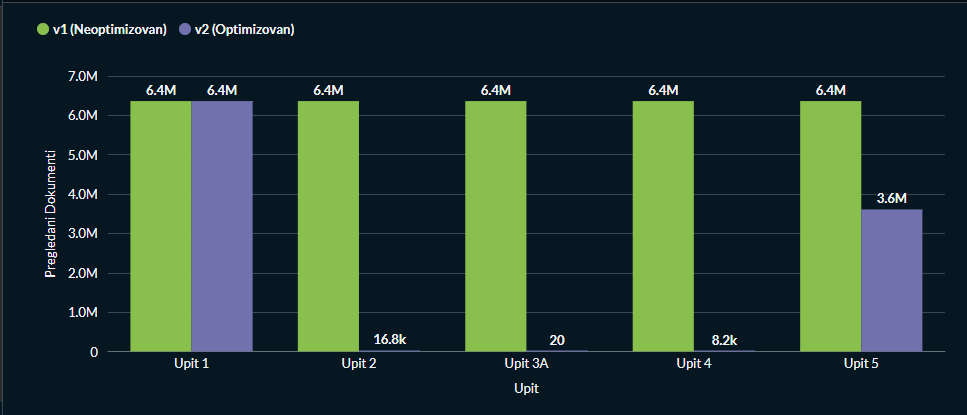
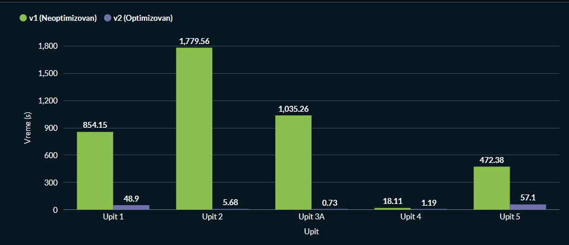

# MongoDB projekat - predmet Sistemi baza podataka

Tema: Analiza i detekcija prevara u mobilnom bankarstvu

Autor: Mila Budimirović IN 22/2021

### Opis skupa podataka

Podaci su uzeti sa sajta Kaggle. Naziv data seta je:  Mobile Money Fraud Detection Dataset. 
Link za dataset: https://www.kaggle.com/datasets/harrachimustapha mobile-money-fraud-detection-dataset

Ukupna veličina dataseta je 2.7 GB. Sadrži 6 miliona transakcija. 

Skup podataka je organizovan u 8 csv fajlova. Osnovna datoteka sadrži originalne informacije o transakcijama, dok dodatne datoteke pružaju informacije o ponašanju pošiljaoca, interakcije pošiljaoca i primaoca, analizu mreže, bodovanje rizika i obeležavanje scenarija prevare. 

## O realizaciji projekta

inicijalna šema baze podataka se nalazi u direktorijumu  

Optimizovana šema se nalazi u direktorijumu 

### Upiti 

1. Koji tipovi transakcija ka novim primaocima (is_new_receiver_for_sender = 1) najčešće rezultuju prevarama, i kako se prosečan risk_score razlikuje u zavisnosti od toga da li je primalac merchant ili customer?

2. U kom periodu dana je suspicious_cashout_flag najčešći, koji fraud_scenario dominira u tom periodu i koliki je prosečan iznos tih transakcija u odnosu na ostale?

3. Koji primaoci su primili novac od najvećeg broja različitih pošiljalaca, koliki je procenat tih transakcija označen kao prevara i koji risk_level dominira među njima?

4. Koje kombinacije rizičnih oznaka se najčešće pojavljuju kod kvarnih transakcija i u kom periodu dana se te transakcije najčešće dešavaju?

5. Koliki procenat transakcija gde je stanje pošiljaoca palo na nulu nakon transakcije je označen kao prevara, grupisano po tipu transakcije i nivou rizika, i kako se prosečan risk_score razlikuje između originalnih PaySim prevara i engineered scenarija?

## Statistika i grafici 

