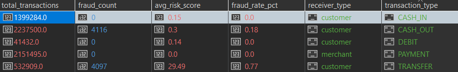
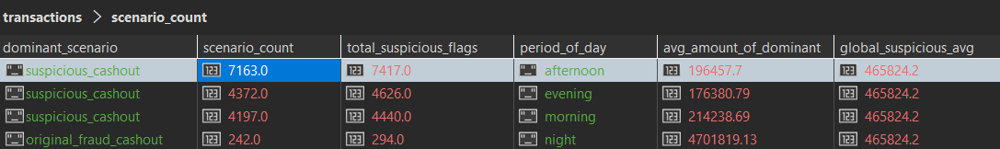
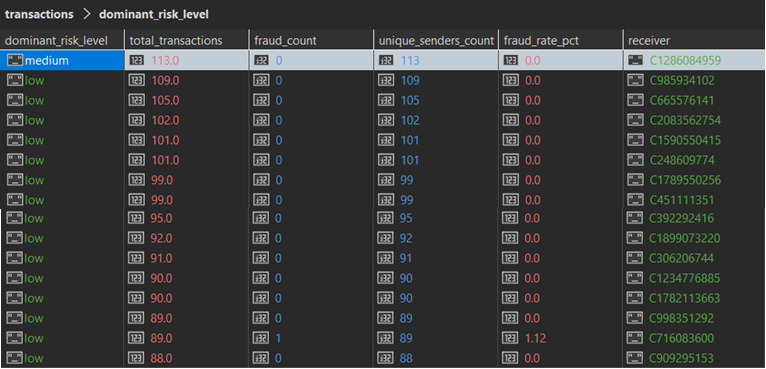

# Upiti

## Prvi upit

Koji tipovi transakcija ka novim primaocima (is_new_receiver_for_sender = 1) najčešće rezultuju prevarama i kako se prosečan risk_score razlikuje u zavisnosti od toga da li je primalac merchant ili customer?


```javascript
db.getCollection('transactions').aggregate([
  { 
    $match: { 
      "sender_receiver_relation.is_new_receiver_for_sender": 1 
    } 
  },

  {
    $lookup: {
      from: "risk_profiles",
      localField: "_id",
      foreignField: "_id",
      as: "risk_data"
    }
  },

  { 
    $unwind: "$risk_data" 
  },

  {
    $group: {
      _id: {
        type: "$type",
        is_merchant: "$receiver.is_merchant_dest"
      },
      total_transactions: { $sum: 1 },
      fraud_count: { $sum: "$risk_data.fraud_label.isFraud" },
      avg_risk_score: { $avg: "$risk_data.risk.risk_score_rule_based" }
    }
  },

  {
    $addFields: {
      fraud_rate_pct: {
        $round: [
          { $multiply: [{ $divide: ["$fraud_count", "$total_transactions"] }, 100] },
          2
        ]
      },
      avg_risk_score: { $round: ["$avg_risk_score", 2] },
      receiver_type: {
        $cond: { if: { $eq: ["$_id.is_merchant", 1] }, then: "merchant", else: "customer" }
      }
    }
  },

  { 
    $sort: { fraud_count: -1 } 
  },

  {
    $project: {
      _id: 0,
      transaction_type: "$_id.type",
      receiver_type: 1,
      total_transactions: 1,
      fraud_count: 1,
      fraud_rate_pct: 1,
      avg_risk_score: 1
    }
  }
], { allowDiskUse: true })

```

### Rezultat upita:



Vreme izvrsavanja: 14 min 26 sek

Transfer - customer je najopasniji tip. Ima 4097 prevara na 532000 transkacija. Cash-Out ima najveci broj prevara ali ima i najveci broj transakcija pa je fraud_rate mnogo nizi. Po avg_risk_score vidimo da sistem mnogo bolje detektuje TRANSFER prevare nego CASH_OUT prevare.


## Drugi upit

U kom periodu dana je suspicious_cashout_flag najčešći, koji fraud_scenario dominira u tom periodu i koliki je prosečan iznos tih transakcija u odnosu na ostale?

```javascript
db.getCollection('transactions').aggregate([
  {
    $lookup: {
      from: "risk_profiles",
      localField: "_id",
      foreignField: "_id",
      as: "risk_data"
    }
  },
  { $unwind: "$risk_data" },
  
  {
    $match: {
      "risk_data.risk.flags.suspicious_cashout_flag": 1
    }
  },
  
  {
    $group: {
      _id: {
        period_of_day: "$temporal.period_of_day",
        fraud_scenario: "$risk_data.fraud_label.fraud_scenario"
      },
      scenario_count: { $sum: 1 },
      avg_amount: { $avg: "$amount" }
    }
  },
  
  { $sort: { "_id.period_of_day": 1, scenario_count: -1 } },
  
  {
    $group: {
      _id: "$_id.period_of_day",
      dominant_scenario: { $first: "$_id.fraud_scenario" },
      scenario_count: { $first: "$scenario_count" },
      total_suspicious_flags: { $sum: "$scenario_count" },
      avg_amount_of_dominant: { $first: "$avg_amount" }
    }
  },
  
  { $sort: { total_suspicious_flags: -1 } },
  
  {
    $project: {
      _id: 0,
      period_of_day: "$_id",
      total_suspicious_flags: 1,
      dominant_scenario: 1,
      scenario_count: 1,
      avg_amount_of_dominant: { $round: ["$avg_amount_of_dominant", 2] },
      
      global_suspicious_avg: { $literal: 465824.20 }
    }
  }
], { allowDiskUse: true })

```

### Rezultat upita:



Vreme izvrsavanja: 23 min 56 sek

Najveci broj "sumnjivih" isplata je tokom dana (popodne). Ujutru i popodne dominira scenario suspicious_caschout. Nocu dominira scenario original_fraud_cashout (od 294 flaga - 242 su dokazane prevare). Prosecan iznos sumnjivih transakcija nocu je mnogo veci od proseka sistema.


## Treci upit

### 3a
Koji primaoci su primili novac od najvećeg broja različitih pošiljalaca, koliki je procenat tih transakcija označen kao prevara i koji risk_level dominira među njima?

```javascript


db.getCollection('transactions').aggregate([
  {
    $lookup: {
      from: "risk_profiles",
      localField: "_id",
      foreignField: "_id",
      as: "risk_data"
    }
  },
  { $unwind: "$risk_data" },

  {
    $group: {
      _id: {
        receiver: "$receiver.nameDest",
        risk_lvl: "$risk_data.risk.risk_level"
      },
      senders_set: { $addToSet: "$sender.nameOrig" },
      total_tx_for_risk: { $sum: 1 },
      fraud_count_for_risk: { $sum: "$risk_data.fraud_label.isFraud" }
    }
  },

  { $sort: { total_tx_for_risk: -1 } },

  {
    $group: {
      _id: "$_id.receiver",
      dominant_risk_level: { $first: "$_id.risk_lvl" },
      all_unique_senders: { $addToSet: "$senders_set" },
      total_transactions: { $sum: "$total_tx_for_risk" },
      fraud_count: { $sum: "$fraud_count_for_risk" }
    }
  },

  {
    $addFields: {
      merged_senders: {
        $reduce: {
          input: "$all_unique_senders",
          initialValue: [],
          in: { $setUnion: ["$$value", "$$this"] }
        }
      }
    }
  },

  {
    $addFields: {
      unique_senders_count: { $size: "$merged_senders" },
      fraud_rate_pct: {
        $round: [
          {
            $multiply: [
              {
                $cond: [
                  { $eq: ["$total_transactions", 0] },
                  0,
                  { $divide: ["$fraud_count", "$total_transactions"] }
                ]
              },
              100
            ]
          },
          2
        ]
      }
    }
  },

  { $sort: { unique_senders_count: -1 } },
  { $limit: 20 },

  {
    $project: {
      _id: 0,
      receiver: "$_id",
      unique_senders_count: 1,
      total_transactions: 1,
      fraud_count: 1,
      fraud_rate_pct: 1,
      dominant_risk_level: 1
    }
  }
], { allowDiskUse: true })


```

### Rezultat upita:



Vreme izvrsavanja: 17 min 54 sek

Najaktivniji primalac je C1286084959, primio je novac od 113 različitih pošiljalaca kroz 113 transakcija. On je oznacen kao medium rizik, isključivo zbog ekstremne frekvencije transakcija koja ga izdvaja iz proseka.