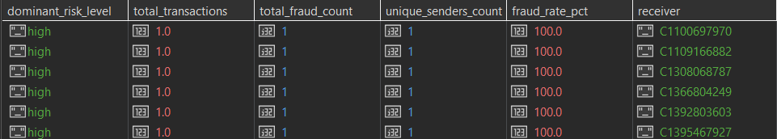
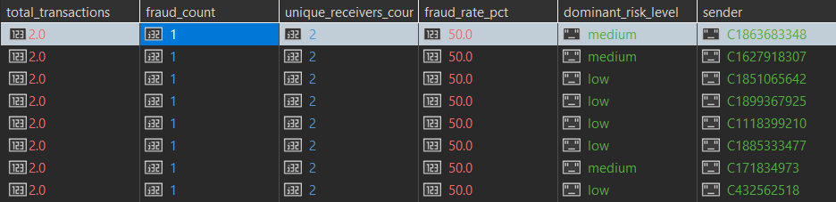
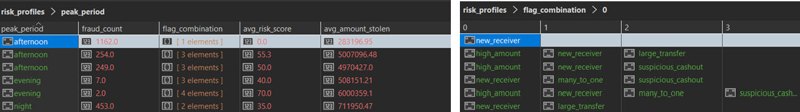

# Upiti

## Prvi upit

Koji tipovi transakcija ka novim primaocima (is_new_receiver_for_sender = 1) najčešće rezultuju prevarama i kako se prosečan risk_score razlikuje u zavisnosti od toga da li je primalac merchant ili customer?


```javascript
db.getCollection('transactions').aggregate([
  { 
    $match: { 
      "sender_receiver_relation.is_new_receiver_for_sender": 1 
    } 
  },

  {
    $lookup: {
      from: "risk_profiles",
      localField: "_id",
      foreignField: "_id",
      as: "risk_data"
    }
  },

  { 
    $unwind: "$risk_data" 
  },

  {
    $group: {
      _id: {
        type: "$type",
        is_merchant: "$receiver.is_merchant_dest"
      },
      total_transactions: { $sum: 1 },
      fraud_count: { $sum: "$risk_data.fraud_label.isFraud" },
      avg_risk_score: { $avg: "$risk_data.risk.risk_score_rule_based" }
    }
  },

  {
    $addFields: {
      fraud_rate_pct: {
        $round: [
          { $multiply: [{ $divide: ["$fraud_count", "$total_transactions"] }, 100] },
          2
        ]
      },
      avg_risk_score: { $round: ["$avg_risk_score", 2] },
      receiver_type: {
        $cond: { if: { $eq: ["$_id.is_merchant", 1] }, then: "merchant", else: "customer" }
      }
    }
  },

  { 
    $sort: { fraud_count: -1 } 
  },

  {
    $project: {
      _id: 0,
      transaction_type: "$_id.type",
      receiver_type: 1,
      total_transactions: 1,
      fraud_count: 1,
      fraud_rate_pct: 1,
      avg_risk_score: 1
    }
  }
], { allowDiskUse: true })

```

### Rezultat upita:


***Vreme izvrsavanja:*** 14 min 26 sek

Transfer - customer je najopasniji tip. Ima 4097 prevara na 532000 transkacija. Cash-Out ima najveci broj prevara ali ima i najveci broj transakcija pa je fraud_rate mnogo nizi. Po avg_risk_score vidimo da sistem mnogo bolje detektuje TRANSFER prevare nego CASH_OUT prevare.


## Drugi upit

U kom periodu dana je suspicious_cashout_flag najčešći, koji fraud_scenario dominira u tom periodu i koliki je prosečan iznos tih transakcija u odnosu na ostale?

```javascript
db.getCollection('transactions').aggregate([
  {
    $lookup: {
      from: "risk_profiles",
      localField: "_id",
      foreignField: "_id",
      as: "risk_data"
    }
  },
  { $unwind: "$risk_data" },
  
  {
    $match: {
      "risk_data.risk.flags.suspicious_cashout_flag": 1
    }
  },
  
  {
    $group: {
      _id: {
        period_of_day: "$temporal.period_of_day",
        fraud_scenario: "$risk_data.fraud_label.fraud_scenario"
      },
      scenario_count: { $sum: 1 },
      avg_amount: { $avg: "$amount" }
    }
  },
  
  { $sort: { "_id.period_of_day": 1, scenario_count: -1 } },
  
  {
    $group: {
      _id: "$_id.period_of_day",
      dominant_scenario: { $first: "$_id.fraud_scenario" },
      scenario_count: { $first: "$scenario_count" },
      total_suspicious_flags: { $sum: "$scenario_count" },
      avg_amount_of_dominant: { $first: "$avg_amount" }
    }
  },
  
  { $sort: { total_suspicious_flags: -1 } },
  
  {
    $project: {
      _id: 0,
      period_of_day: "$_id",
      total_suspicious_flags: 1,
      dominant_scenario: 1,
      scenario_count: 1,
      avg_amount_of_dominant: { $round: ["$avg_amount_of_dominant", 2] },
      
      global_suspicious_avg: { $literal: 465824.20 }
    }
  }
], { allowDiskUse: true })

```

### Rezultat upita:


***Vreme izvrsavanja:*** 23 min 56 sek

Najveci broj "sumnjivih" isplata je tokom dana (popodne). Ujutru i popodne dominira scenario suspicious_caschout. Nocu dominira scenario original_fraud_cashout (od 294 flaga - 242 su dokazane prevare). Prosecan iznos sumnjivih transakcija nocu je mnogo veci od proseka sistema.


## Treci upit

### 3A
Koji primaoci su primili novac od najvećeg broja različitih pošiljalaca, koliki je procenat tih transakcija označen kao prevara i koji risk_level dominira među njima?

```javascript


db.getCollection('transactions').aggregate([
  {
    $lookup: {
      from: "risk_profiles",
      localField: "_id",
      foreignField: "_id",
      as: "risk_data"
    }
  },
  { $unwind: "$risk_data" },

  {
    $group: {
      _id: {
        receiver: "$receiver.nameDest",
        risk_lvl: "$risk_data.risk.risk_level"
      },
      senders_set: { $addToSet: "$sender.nameOrig" },
      total_tx_for_risk: { $sum: 1 },
      fraud_count_for_risk: { $sum: "$risk_data.fraud_label.isFraud" }
    }
  },

  { $sort: { total_tx_for_risk: -1 } },

  {
    $group: {
      _id: "$_id.receiver",
      dominant_risk_level: { $first: "$_id.risk_lvl" },
      all_unique_senders: { $addToSet: "$senders_set" },
      total_transactions: { $sum: "$total_tx_for_risk" },
      fraud_count: { $sum: "$fraud_count_for_risk" }
    }
  },

  {
    $addFields: {
      merged_senders: {
        $reduce: {
          input: "$all_unique_senders",
          initialValue: [],
          in: { $setUnion: ["$$value", "$$this"] }
        }
      }
    }
  },

  {
    $addFields: {
      unique_senders_count: { $size: "$merged_senders" },
      fraud_rate_pct: {
        $round: [
          {
            $multiply: [
              {
                $cond: [
                  { $eq: ["$total_transactions", 0] },
                  0,
                  { $divide: ["$fraud_count", "$total_transactions"] }
                ]
              },
              100
            ]
          },
          2
        ]
      }
    }
  },

  { $sort: { unique_senders_count: -1 } },
  { $limit: 20 },

  {
    $project: {
      _id: 0,
      receiver: "$_id",
      unique_senders_count: 1,
      total_transactions: 1,
      fraud_count: 1,
      fraud_rate_pct: 1,
      dominant_risk_level: 1
    }
  }
], { allowDiskUse: true })


```

### Rezultat upita:


***Vreme izvrsavanja:*** 17 min 54 sek

Najaktivniji primalac je C1286084959, primio je novac od 113 različitih pošiljalaca kroz 113 transakcija. On je oznacen kao medium rizik, isključivo zbog ekstremne frekvencije transakcija koja ga izdvaja iz proseka. 

### 3B

Po prethodnom upitu vidimo da se prevaranti ne kriju iza računa koji imaju veliki broj prijema transakcija. Želimo da otkrijemo koji korisnici vrše najvise prevara. Pretrazujemo kakvi primaoci imaju dokazane prevare i HIGH nivo rizika.


```javascript
db.getCollection('transactions').aggregate([
  {
    $lookup: {
      from: "risk_profiles",
      localField: "_id",
      foreignField: "_id",
      as: "risk_data"
    }
  },
  { $unwind: "$risk_data" },

  {
    $group: {
      _id: {
        receiver: "$receiver.nameDest",
        risk_lvl: "$risk_data.risk.risk_level"
      },
      unique_senders: { $addToSet: "$sender.nameOrig" },
      total_tx_for_risk: { $sum: 1 },
      fraud_count_for_risk: { $sum: "$risk_data.fraud_label.isFraud" }
    }
  },

  { $sort: { total_tx_for_risk: -1 } },

  {
    $group: {
      _id: "$_id.receiver",
      dominant_risk_level: { $first: "$_id.risk_lvl" },
      all_unique_senders: { $addToSet: "$unique_senders" },
      total_transactions: { $sum: "$total_tx_for_risk" },
      total_fraud_count: { $sum: "$fraud_count_for_risk" }
    }
  },


  {
    $match: {
      total_fraud_count: { $gt: 0 },
      dominant_risk_level: { $regex: /^high$/i } 
    }
  },

  
  {
    $addFields: {
      merged_senders: {
        $reduce: {
          input: "$all_unique_senders",
          initialValue: [],
          in: { $setUnion: ["$$value", "$$this"] }
        }
      }
    }
  },

  {
    $addFields: {
      unique_senders_count: { $size: "$merged_senders" },
      fraud_rate_pct: {
        $round: [
          { $multiply: [{ $divide: ["$total_fraud_count", "$total_transactions"] }, 100] },
          2
        ]
      }
    }
  },

  { $sort: { total_fraud_count: -1 } },
  { $limit: 20 },

  {
    $project: {
      _id: 0,
      receiver: "$_id",
      total_fraud_count: 1,
      total_transactions: 1,
      fraud_rate_pct: 1,
      unique_senders_count: 1,
      dominant_risk_level: 1
    }
  }
], { allowDiskUse: true })
```

### Rezultat upita: 



***Vreme izvrsavanja:*** 16 min 24 sek

Svi nalozi na crnoj listi imaju tačno **1 transakciju, 1 pošiljaoca i 1 prevaru (100% fraud rate)**. Ovo dokazuje masovno korišćenje jednokratnih (*burner*) računa primalaca koji se odmah gase nakon izvlačenja novca.


### 3C

Prethodne analize su bile fokusirane isključivo na primaoce, što nam je otkrilo da su računi koji primaju sredstva iz prevara u najvećem broju slučajeva jednokratni nalozi. Međutim, ostalo je otvoreno ključno pitanje o ponašanju napadača: Da li iza ovih incidenata stoje serijski napadaci koji sa jednog lažnog naloga šalju novac na više različitih jednokratnih računa, ili su i sami pošiljaoci jednokratni?

 **Cilj upita:** Grupisanje podataka isključivo po pošiljaocu, uz praćenje broja jedinstvenih primalaca, kako bi se precizno utvrdilo da li u sistemu postoji obrazac povezanih, ponovljenih napada sa iste tačke, ili je u pitanju strogi model (jednokratni pošiljalac na jednokratnog primaoca).


```javascript
 db.getCollection('transactions').aggregate([
  {
    $lookup: {
      from: "risk_profiles",
      localField: "_id",
      foreignField: "_id",
      as: "risk_data"
    }
  },
  { $unwind: "$risk_data" },

  {
    $group: {
      _id: "$sender.nameOrig",
      total_transactions: { $sum: 1 },
      fraud_count: { $sum: "$risk_data.fraud_label.isFraud" },
      unique_receivers: { $addToSet: "$receiver.nameDest" },
      risk_levels: { $push: "$risk_data.risk.risk_level" }
    }
  },

  {
    $match: {
      fraud_count: { $gt: 0 }
    }
  },

  {
    $addFields: {
      unique_receivers_count: { $size: "$unique_receivers" },
      fraud_rate_pct: {
        $round: [
          { $multiply: [{ $divide: ["$fraud_count", "$total_transactions"] }, 100] },
          2
        ]
      },
      dominant_risk_level: { $first: "$risk_levels" }
    }
  },

  { $sort: { fraud_count: -1, total_transactions: -1 } },
  { $limit: 20 },

  {
    $project: {
      _id: 0,
      sender: "$_id",
      total_transactions: 1,
      fraud_count: 1,
      fraud_rate_pct: 1,
      unique_receivers_count: 1, 
      dominant_risk_level: 1
    }
  }
], { allowDiskUse: true })
```


### Rezultat upita: 



***Vreme izvrsavanja:*** 15 min 35 sek

Rezultati ovog upita nedvosmisleno pokazuju da napadači ne koriste čiste, jednokratne (burner) naloge na strani pošiljalaca, već se oslanjaju na specifičnu "Test-then-Strike" taktiku. Koriste dve transakcije kao šablon, gde prvo izvrše jednu legitimnu transakciju kako bi testirali račun i odgovor sistema, a tek onda šalju lažnu transakciju na jednokratni račun.


## Cetvrti upit

Koje kombinacije rizičnih oznaka se najčešće pojavljuju kod kvarnih transakcija i u kom periodu dana se te transakcije najčešće dešavaju? Koliki je avg risk score i avg suma novca svake kombinacije?


```javascript
db.getCollection('risk_profiles').aggregate([
  { $match: { "fraud_label.isFraud": 1 } },
  
  {
    $lookup: {
      from: "transactions",
      localField: "_id",
      foreignField: "_id",
      as: "tx_data"
    }
  },
  { $unwind: "$tx_data" },
  
  {
    $addFields: {
      active_flags: {
        $filter: {
          input: [
            { $cond: [{ $eq: ["$risk.flags.high_amount_flag", 1] }, "high_amount", "$$REMOVE"] },
            { $cond: [{ $eq: ["$risk.flags.high_velocity_flag", 1] }, "high_velocity", "$$REMOVE"] },
            { $cond: [{ $eq: ["$risk.flags.new_receiver_flag", 1] }, "new_receiver", "$$REMOVE"] },
            { $cond: [{ $eq: ["$risk.flags.many_to_one_receiver_flag", 1] }, "many_to_one", "$$REMOVE"] },
            { $cond: [{ $eq: ["$risk.flags.suspicious_cashout_flag", 1] }, "suspicious_cashout", "$$REMOVE"] },
            { $cond: [{ $eq: ["$risk.flags.large_transfer_flag", 1] }, "large_transfer", "$$REMOVE"] }
          ],
          as: "f",
          cond: { $ne: ["$$f", null] }
        }
      }
    }
  },

  {
    $group: {
      _id: {
        flags: "$active_flags",
        period: "$tx_data.temporal.period_of_day"
      },
      count: { $sum: 1 },
      avg_risk: { $avg: "$risk.risk_score_rule_based" },
      avg_money: { $avg: "$tx_data.amount" } 
    }
  },

  { $sort: { "_id.flags": 1, "count": -1 } },

  {
    $group: {
      _id: "$_id.flags",
      peak_period: { $first: "$_id.period" },
      fraud_count: { $first: "$count" },
      avgr_risk_score: { $first: "$avg_risk" },
      avg_fraud_amount: { $first: "$avg_money" } 
    }
  },

  { $sort: { fraud_count: -1 } },
  { $limit: 15 },
  
  {
    $project: {
      _id: 0,
      flag_combination: "$_id",
      peak_period: 1,
      fraud_count: 1,
     avg_risk_score: { $round: ["$avgr_risk_score", 2] },
    avg_amount_stolen: { $round: ["$avg_fraud_amount", 2] }
    }
  }
], { allowDiskUse: true })
```

### Rezultat upita: 




***Vreme izvrsavanja:*** 13 sek


Što je kombinacija flegova složenija, to je prosečan rizik drastično veći. Pojedinačni flegovi imaju rizik 0.0, dok kombinacije sa 3 ili 4 flega imaju prosečan rizik preko 50.0 i 70.0, što pokazuje da sistem odlično prepoznaje udružene flagove.

Popodne imamo najvise prevara, dok uveče imamo specifičnije i složenije napade. Iako su prevare sa samo jednim flegom (new_receiver) najbrojnije (1,162), one odnose manje iznose (283 000). Prava finansijska šteta leži u trostrukim kombinacijama flegova koje uključuju high_amount, gde prosečan ukradeni iznos skače na blizu 5 miliona po transakciji.