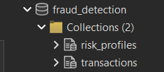
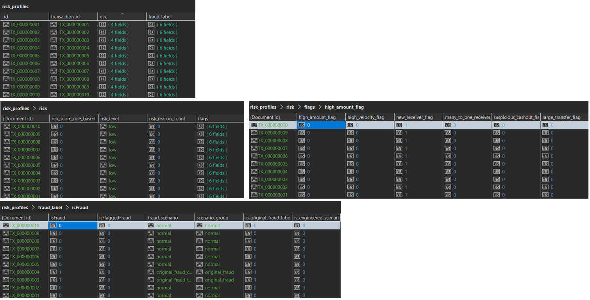
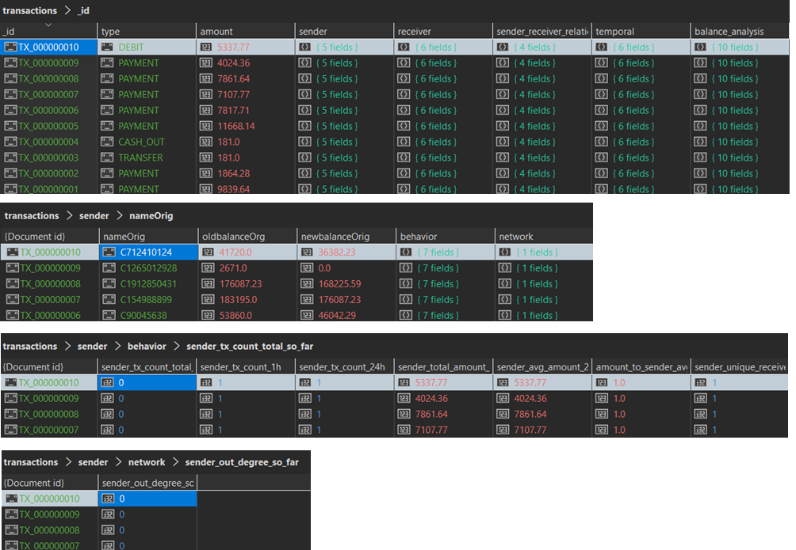
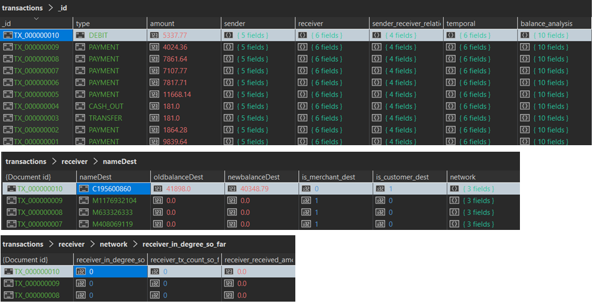
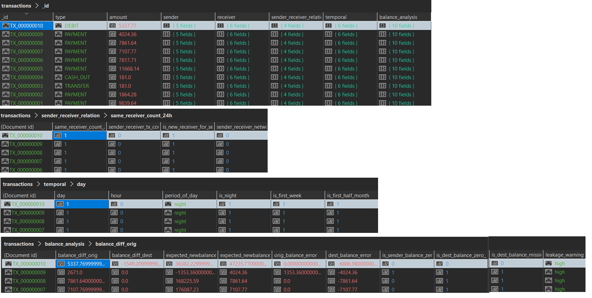

# Prva verzija šeme baze podataka

## Prva verzija se sastoji od 2 kolekcije 

###  Kolekcija risk_profiles

Sadrzi podatke vezane za analitički deo i bezbednosne aspekte. Ona povezuje profil transakcije sa sistemom za rano upozorenje i konačnim ishodom (da li je transakcija prevara ili ne).

### Kolekcija transactions

Predstavlja najbitniji deo sistema i sadrži sve detaljne informacije o samom toku finansijske transakcije, ucesnicima (posiljalac i primalac), njihovom ponasanju, mrežnim karakteristikama i vremenu.

