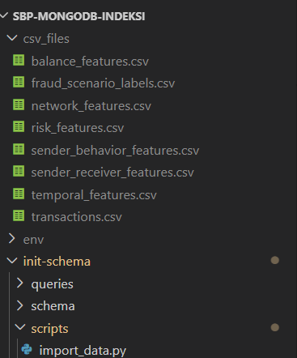

# Analiza i Detekcija Prevara u Mobilnom Bankarstvu
**Uloga:** Fraud Analyst (Analitičar prevara)

Ovaj projekat se bavi analizom sintetičkog skupa podataka mobilnih novčanih transakcija u cilju detekcije i prevencije prevara.

---

## 1. Preduslovi i Podaci

Pre pokretanja skripte import_data.py, potrebno je obezbediti podatke sa Kaggle-a i instalirati potrebne Python biblioteke.

### Podaci
* **Izvor:** [Mobile Money Fraud Detection Dataset na Kaggle-u](https://www.kaggle.com/datasets/harrachimustapha/mobile-money-fraud-detection-dataset) (Veličina: 2.7GB, preko 6.3 miliona transakcija).
* **Uputstvo:** Sve preuzete `.csv` datoteke smestite u folder `csv_files/` unutar projekta.

### Potrebne Python biblioteke
Instalirajte biblioteke pokretanjem sledećih komandi u terminalu:

```bash
pip install pandas
pip install pymongo
pip install tqdm
```

## 2. Struktura Direktorijuma

Ispod je prikazana trenutna struktura foldera i datoteka unutar projekta:




Baza podataka: Skripta očekuje da je MongoDB pokrenut na localhost:27017. Kreirana baza imaće naziv fraud_detection


### 3. Sledeci koraci
1. Pokrenite skriptu `import_data.py`. (podaci su vec ocisceni, samo ubacujemo u bazu)
2. Sačekajte da se podaci učitaju u MongoDB bazu.