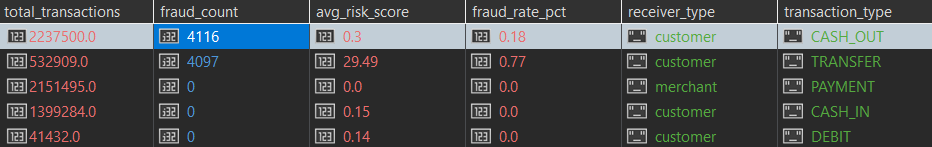
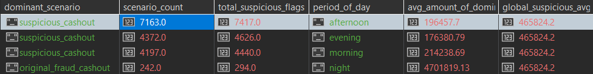

# Upiti

## Prvi upit

Koji tipovi transakcija ka novim primaocima (is_new_receiver_for_sender = 1) najčešće rezultuju prevarama i kako se prosečan risk_score razlikuje u zavisnosti od toga da li je primalac merchant ili customer?


```javascript

db.getCollection('transactions_v2').aggregate([
  { $match: { "sender_receiver_relation.is_new_receiver_for_sender": 1 } },
  {
    $group: {
      _id: { type: "$type", is_merchant: "$receiver.is_merchant_dest" },
      total_transactions: { $sum: 1 },
      fraud_count: { $sum: "$fraud_label.isFraud" },
      avg_risk_score: { $avg: "$risk.risk_score_rule_based" }
    }
  },
  {
    $addFields: {
      fraud_rate_pct: { $round: [{ $multiply: [{ $divide: ["$fraud_count", "$total_transactions"] }, 100] }, 2] },
      avg_risk_score: { $round: ["$avg_risk_score", 2] },
      receiver_type: { $cond: { if: { $eq: ["$_id.is_merchant", 1] }, then: "merchant", else: "customer" } }
    }
  },
  { $sort: { fraud_count: -1 } },
  {
    $project: {
      _id: 0,
      transaction_type: "$_id.type",
      receiver_type: 1,
      total_transactions: 1,
      fraud_count: 1,
      fraud_rate_pct: 1,
      avg_risk_score: 1
    }
  }
], { allowDiskUse: true })

```

### Rezultat upita:




***Vreme izvrsavanja:*** 36 sek 

## Drugi upit

U kom periodu dana je suspicious_cashout_flag najčešći, koji fraud_scenario dominira u tom periodu i koliki je prosečan iznos tih transakcija u odnosu na ostale?

```javascript
db.getCollection('transactions_v2').aggregate([
  {
    $match: {
      "risk.active_flags": "suspicious_cashout"
    }
  },
  

  {
    $group: {
      _id: {
        period_of_day: "$temporal.period_of_day",
        fraud_scenario: "$fraud_label.fraud_scenario"
      },
      scenario_count: { $sum: 1 },
      avg_amount: { $avg: "$amount" }
    }
  },
  
  { $sort: { "_id.period_of_day": 1, scenario_count: -1 } },
  
  {
    $group: {
      _id: "$_id.period_of_day",
      dominant_scenario: { $first: "$_id.fraud_scenario" },
      scenario_count: { $first: "$scenario_count" },
      total_suspicious_flags: { $sum: "$scenario_count" },
      avg_amount_of_dominant: { $first: "$avg_amount" }
    }
  },
  
  { $sort: { total_suspicious_flags: -1 } },
  
  {
    $project: {
      _id: 0,
      period_of_day: "$_id",
      total_suspicious_flags: 1,
      dominant_scenario: 1,
      scenario_count: 1,
      avg_amount_of_dominant: { $round: ["$avg_amount_of_dominant", 2] },
      global_suspicious_avg: { $literal: 465824.20 }
    }
  }
], { allowDiskUse: true })


```
### Rezultat upita:



***Vreme izvrsavanja:*** 16 sek bez indeksa, 0.7 sek sa indeksom 
