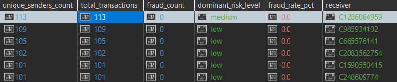
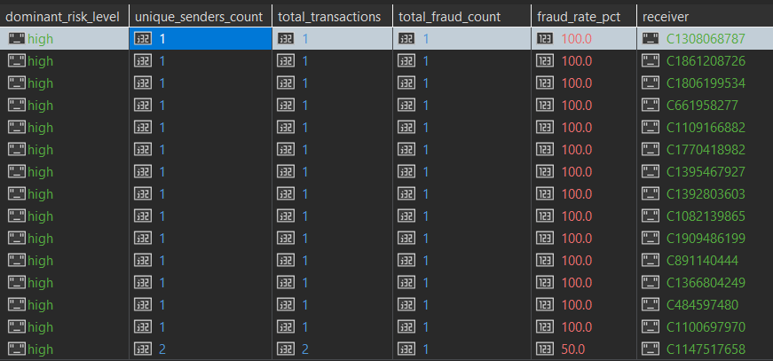
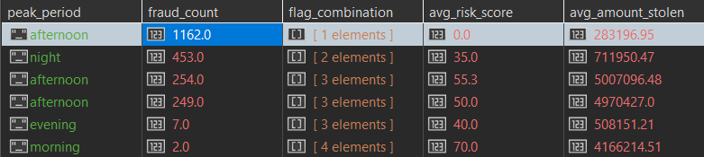
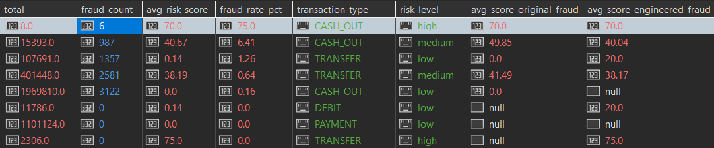

# Upiti

## Prvi upit

Koji tipovi transakcija ka novim primaocima (is_new_receiver_for_sender = 1) najčešće rezultuju prevarama i kako se prosečan risk_score razlikuje u zavisnosti od toga da li je primalac merchant ili customer?


```javascript

db.getCollection('transactions_v2').aggregate([
  { $match: { "sender_receiver_relation.is_new_receiver_for_sender": 1 } },
  {
    $group: {
      _id: { type: "$type", is_merchant: "$receiver.is_merchant_dest" },
      total_transactions: { $sum: 1 },
      fraud_count: { $sum: "$fraud_label.isFraud" },
      avg_risk_score: { $avg: "$risk.risk_score_rule_based" }
    }
  },
  {
    $addFields: {
      fraud_rate_pct: { $round: [{ $multiply: [{ $divide: ["$fraud_count", "$total_transactions"] }, 100] }, 2] },
      avg_risk_score: { $round: ["$avg_risk_score", 2] },
      receiver_type: { $cond: { if: { $eq: ["$_id.is_merchant", 1] }, then: "merchant", else: "customer" } }
    }
  },
  { $sort: { fraud_count: -1 } },
  {
    $project: {
      _id: 0,
      transaction_type: "$_id.type",
      receiver_type: 1,
      total_transactions: 1,
      fraud_count: 1,
      fraud_rate_pct: 1,
      avg_risk_score: 1
    }
  }
], { allowDiskUse: true })

```

### Rezultat upita:


***Vreme izvrsavanja:*** 36 sek 

## Drugi upit

U kom periodu dana je suspicious_cashout_flag najčešći, koji fraud_scenario dominira u tom periodu i koliki je prosečan iznos tih transakcija u odnosu na ostale?

```javascript
db.getCollection('transactions_v2').aggregate([
  {
    $match: {
      "risk.active_flags": "suspicious_cashout"
    }
  },
  
  {
    $group: {
      _id: {
        period_of_day: "$temporal.period_of_day",
        fraud_scenario: "$fraud_label.fraud_scenario"
      },
      scenario_count: { $sum: 1 },
      avg_amount: { $avg: "$amount" }
    }
  },
  
  { $sort: { "_id.period_of_day": 1, scenario_count: -1 } },
  
  {
    $group: {
      _id: "$_id.period_of_day",
      dominant_scenario: { $first: "$_id.fraud_scenario" },
      scenario_count: { $first: "$scenario_count" },
      total_suspicious_flags: { $sum: "$scenario_count" },
      avg_amount_of_dominant: { $first: "$avg_amount" }
    }
  },
  
  { $sort: { total_suspicious_flags: -1 } },
  
  {
    $project: {
      _id: 0,
      period_of_day: "$_id",
      total_suspicious_flags: 1,
      dominant_scenario: 1,
      scenario_count: 1,
      avg_amount_of_dominant: { $round: ["$avg_amount_of_dominant", 2] },
      global_suspicious_avg: { $literal: 465824.20 }
    }
  }
], { allowDiskUse: true })


```
### Rezultat upita:


***Vreme izvrsavanja:*** 16 sek bez indeksa, 0.7 sek sa indeksom 


## Treci upit

### 3A
Koji primaoci su primili novac od najvećeg broja različitih pošiljalaca, koliki je procenat tih transakcija označen kao prevara i koji risk_level dominira među njima? (pravimo upit nad novom kolekcijom)

```javascript


db.getCollection('receivers_summary').aggregate([
  { $sort: { unique_senders_count: -1 } },

  { $limit: 20 },

  {
    $lookup: {
      from: "transactions_v2",
      localField: "_id",                  
      foreignField: "receiver.nameDest",  
      as: "raw_transactions"
    }
  },
  { $unwind: "$raw_transactions" },

  {
    $group: {
      _id: {
        receiver: "$_id",
        risk_lvl: "$raw_transactions.risk.risk_level"
      },
      unique_senders_count: { $first: "$unique_senders_count" },
      total_transactions: { $first: "$total_transactions" },
      fraud_count: { $first: "$fraud_count" },
      risk_lvl_count: { $sum: 1 } 
    }
  },

  { $sort: { "_id.receiver": 1, risk_lvl_count: -1 } },

  {
    $group: {
      _id: "$_id.receiver",
      unique_senders_count: { $first: "$unique_senders_count" },
      total_transactions: { $first: "$total_transactions" },
      fraud_count: { $first: "$fraud_count" },
      dominant_risk_level: { $first: "$_id.risk_lvl" }
    }
  },

  {
    $addFields: {
      fraud_rate_pct: {
        $round: [
          {
            $multiply: [
              {
                $cond: [
                  { $eq: ["$total_transactions", 0] },
                  0,
                  { $divide: ["$fraud_count", "$total_transactions"] }
                ]
              },
              100
            ]
          },
          2
        ]
      }
    }
  },

  { $sort: { unique_senders_count: -1 } },

  
  {
    $project: {
      _id: 0,
      receiver: "$_id",
      unique_senders_count: 1,
      total_transactions: 1,
      fraud_count: 1,
      fraud_rate_pct: 1,
      dominant_risk_level: 1
    }
  }
])


```


### Rezultat upita:



***Vreme izvrsavanja:*** vise od 8 min bez indeksa, 0.019 sek sa indeksom


### 3B

Po prethodnom upitu vidimo da se prevaranti ne kriju iza računa koji imaju veliki broj prijema transakcija. Želimo da otkrijemo koji korisnici vrše najvise prevara. Pretrazujemo kakvi primaoci imaju dokazane prevare i HIGH nivo rizika.

```javascript
    

db.getCollection('receivers_summary').aggregate([
  { $match: { fraud_count: { $gt: 0 } } },

  {
    $lookup: {
      from: "transactions_v2",
      localField: "_id",
      foreignField: "receiver.nameDest",
      as: "raw_transactions"
    }
  },
  { $unwind: "$raw_transactions" },

  {
    $group: {
      _id: {
        receiver: "$_id",
        risk_lvl: "$raw_transactions.risk.risk_level"
      },
      unique_senders_count: { $first: "$unique_senders_count" },
      total_transactions: { $first: "$total_transactions" },
      fraud_count: { $first: "$fraud_count" },
      total_tx_for_risk: { $sum: 1 } 
    }
  },

  { $sort: { total_tx_for_risk: -1 } },

  {
    $group: {
      _id: "$_id.receiver",
      dominant_risk_level: { $first: "$_id.risk_lvl" },
      unique_senders_count: { $first: "$unique_senders_count" },
      total_transactions: { $first: "$total_transactions" },
      total_fraud_count: { $first: "$fraud_count" }
    }
  },

  {
    $match: {
      dominant_risk_level: { $regex: /^high$/i }
    }
  },

  {
    $addFields: {
      fraud_rate_pct: {
        $round: [
          {
            $multiply: [
              {
                $cond: [
                  { $eq: ["$total_transactions", 0] },
                  0,
                  { $divide: ["$total_fraud_count", "$total_transactions"] }
                ]
              },
              100
            ]
          },
          2
        ]
      }
    }
  },

  { $sort: { total_fraud_count: -1 } },
  
  { $limit: 20 },

  {
    $project: {
      _id: 0,
      receiver: "$_id",
      total_fraud_count: 1,
      total_transactions: 1,
      fraud_rate_pct: 1,
      unique_senders_count: 1,
      dominant_risk_level: 1
    }
  }
])

```


### Rezultat upita: 



***Vreme izvrsavanja:*** 12 sek sa indeksom

### 3C

 **Cilj upita:** Grupisanje podataka isključivo po pošiljaocu, uz praćenje broja jedinstvenih primalaca, kako bi se precizno utvrdilo da li u sistemu postoji obrazac povezanih, ponovljenih napada sa iste tačke, ili je u pitanju strogi model (jednokratni pošiljalac na jednokratnog primaoca).


 ***Vreme izvrsavanja:*** Vece nego kod neoptimizovane šeme

 mali dokumenti + $lookup po _id  <  veliki dokumenti bez $lookup


 moze se resiti pravljenjem nove kolekcije za sender_summary kao što smo napravili gore za reciever.

 
## Cetvrti upit

Koje kombinacije rizičnih oznaka se najčešće pojavljuju kod kvarnih transakcija i u kom periodu dana se te transakcije najčešće dešavaju? Koliki je avg risk score i avg suma novca svake kombinacije?


```javascript
db.getCollection('transactions_v2').aggregate([
  { $match: { "fraud_label.isFraud": 1 } },

  {
    $group: {
      _id: {
        flags: "$risk.active_flags",
        period: "$temporal.period_of_day"
      },
      count: { $sum: 1 },
      avg_risk: { $avg: "$risk.risk_score_rule_based" },
      avg_money: { $avg: "$amount" }
    }
  },

  { $sort: { "_id.flags": 1, count: -1 } },

  {
    $group: {
      _id: "$_id.flags",
      peak_period: { $first: "$_id.period" },
      fraud_count: { $first: "$count" },
      avgr_risk_score: { $first: "$avg_risk" },
      avg_fraud_amount: { $first: "$avg_money" }
    }
  },

  { $sort: { fraud_count: -1 } },
  { $limit: 15 },

  {
    $project: {
      _id: 0,
      flag_combination: "$_id",
      peak_period: 1,
      fraud_count: 1,
      avg_risk_score: { $round: ["$avgr_risk_score", 2] },
      avg_amount_stolen: { $round: ["$avg_fraud_amount", 2] }
    }
  }
], { allowDiskUse: true })
```


### Rezultat upita: 




***Vreme izvrsavanja:*** više od neoptimizovanog bez indeksa (13 sek), 0,02 sek sa indeksom 


## Peti upit

Koliki procenat transakcija gde je stanje pošiljaoca palo na nulu nakon transakcije je označen kao prevara, grupisano po tipu transakcije i nivou rizika, i kako se prosečan risk_score razlikuje između originalnih PaySim prevara i engineered scenarija?

```javascript
db.getCollection('transactions_v2').aggregate([
  { $match: { "balance_analysis.is_sender_balance_zero_after": 1 } },
  {
    $group: {
      _id: {
        type: "$type",
        risk_level: "$risk.risk_level"
      },
      total: { $sum: 1 },
      fraud_count: { $sum: "$fraud_label.isFraud" },
      avg_risk_score: { $avg: "$risk.risk_score_rule_based" },
      avg_score_original: {
        $avg: {
          $cond: [
            { $eq: ["$fraud_label.is_original_fraud_label", 1] },
            "$risk.risk_score_rule_based",
            null
          ]
        }
      },
      avg_score_engineered: {
        $avg: {
          $cond: [
            { $eq: ["$fraud_label.is_engineered_scenario", 1] },
            "$risk.risk_score_rule_based",
            null
          ]
        }
      }
    }
  },
  {
    $addFields: {
      fraud_rate_pct: {
        $round: [
          { $multiply: [{ $divide: ["$fraud_count", "$total"] }, 100] },
          2
        ]
      },
      avg_risk_score: { $round: ["$avg_risk_score", 2] },
      avg_score_original: { $round: ["$avg_score_original", 2] },
      avg_score_engineered: { $round: ["$avg_score_engineered", 2] }
    }
  },
  { $sort: { fraud_rate_pct: -1 } },
  {
    $project: {
      _id: 0,
      transaction_type: "$_id.type",
      risk_level: "$_id.risk_level",
      total: 1,
      fraud_count: 1,
      fraud_rate_pct: 1,
      avg_risk_score: 1,
      avg_score_original_fraud: "$avg_score_original",
      avg_score_engineered_fraud: "$avg_score_engineered"
    }
  }
], { allowDiskUse: true })
```


### Rezultat upita: 




***Vreme izvrsavanja:*** 38 sek
