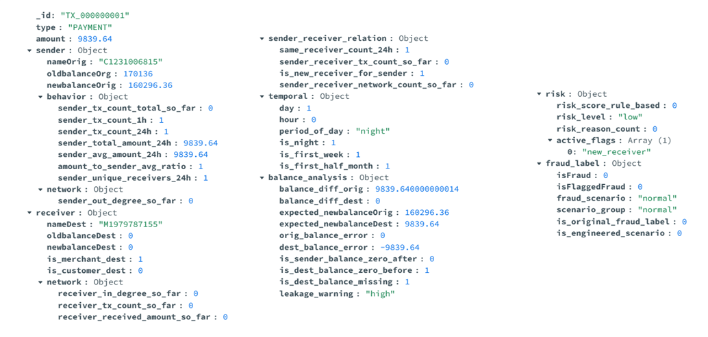
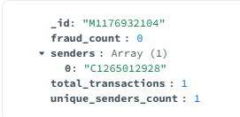

# Druga verzija šeme baza podataka

### Druga verzija šeme baze podataka se sastoji od 1 nove denormalizovane kolekcije (transactions + risks) koja je napravljena radi bržeg izvršavanja upita i 1 nove kolekcije (receivers_summary).

## Denormalizovana kolekcija transactions_v2

Kolekcija sadrži podatke neophodne za izvršavanje osmišljenih upita bez lookupa i unwind funkcija. 

U okviru poddokumenta risk, umesto inicijalnog čuvanja 6 pojedinačnih flagova (gde bi se za svaku transakciju čuvale vrednosti 0 ili 1), primenjen je šablon atributa. Svi aktivni indikatori prevare preformulisani su u dinamički niz stringova pod nazivom active_flags.

## Nova kolekcija receivers_summary

Svaki dokument predstavlja jednog jedinstvenog primaoca (_id je ime primaoca). Za njega se čuvaju unapred proračunati i agregirani podaci: ukupan broj transakcija (total_transactions), broj potvrđenih prevara (fraud_count) i broj jedinstvenih pošiljalaca (unique_senders_count)